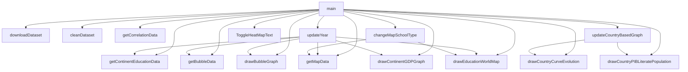

# World Education DashBoard

## Description du projet

Ce mini-projet a pour objectif de permettre à chacun de s'intéresser à l'éducation dans le monde et d'accéder à des données pour mieux comprendre. Pour réaliser ce projet, nous avons utiliser différentes données publiques d'Open Data.

## Guide utilisateur

1. Assurez-vous que le votre dossier "C:\Users\[UserName]\.kaggle" contient bien le fichier kaggle.json contenant votre Token API Kaggle. Pour obtenir votre Token API, connectez vous sur https://www.kaggle.com, puis dans la partie "Settings" et appuyez sur "Create New Token"
2. Installez les dépendances avec la commande : 
`pip install -r requirements.txt`
1. Lancez le dashboard avec : 
`python main.py`

## Données
Plusieurs jeux de données sont utilisées dans ce projet. Le premier jeu de données est un fichier qui provient de The World Bank et contient de nombreuses informations concernant l'éducation mondiale depuis 1999. Il est accessible sur kaggle à l'adresse suivante :
- https://www.kaggle.com/datasets/bushraqurban/world-education-dataset/data

Le deuxième est un fichier csv permettant de relier un pays à son continent et se trouve à cette adresse: 
- https://gist.github.com/stevewithington/20a69c0b6d2ff846ea5d35e5fc47f26c#file-country-and-continent-codes-list-csv-csv

Enfin le dernier jeu de données est un fichier geo.json accessible à cette adresse:
- https://github.com/johan/world.geo.json/blob/master/countries.geo.json?short_path=afdfc39

## Guide développeur

## Rapport d'analyse

### 1. Graphiques généraux

Le premier graphique représente le degré de corrélation entre les différentes colonnes du jeu de données. Plus la couleur d'une case est proche de jaune et sa valeur proche de 1, plus ces deux colonnes sont proportionnelles. Et plus une case est bleue et sa valeur proche de -1, plus elles sont inversement proportionnelles.

> On peut noter que le taux d'alphabétisation des adultes est plutôt proportionnel au pourcentage de réussite en primaire et inversement proportionnel au nombre d'élèves par professeur.

Le deuxième graphique représente le pourcentage moyen du PIB investi dans l'éducation pour chaque continent.

> Presque chaque année, tous les continents ont une moyenne de PIB investi dans l'éducation comprise entre 4 et 5%, sauf l'Océanie qui à une moyenne entre 7 et 9%.

Le troisième graphique montre la répartition des pays en fonction de leur taux de scolarisation et de réussite en primaire. De plus, la taille de chaque pays sur le graphique graphique dépend du pourcentage de son PIB investi dans l'éducation.

> On peut voir sur le graphique que les pays d'Asie, d'Europe, d'Amérique et d'Océanie ont des valeurs plutôt proches en terme de taux de réussite et de scolarisation en primaire, ce qui les regroupe vers le même endroit. Seuls certains pays d'Afrique sont plus dispersés sur le graphique en raison de valeurs plus éloignées.

### 2. Carte du monde

La carte permet de visualiser le nombre d'élèves par professeur en primaire ou sencondaire. 

> L'Afrique Centrale est la région où le nombre moyen d'élèves par professeurs est la plus importantes avec jusqu'à 83 élèves par professeur en primaire en République centrafricaine ou 56 élèves par professeur au Tchad. 

### 3. Graphiques lié à un pays

Le premier graphique lié à un pays représente les taux de scolaraisation en primaire, secondaire et tertiaire ainsi que le taux d'alphabétisation des adultes.

> Les courbes de taux de scolarisation en primaire et en secondaire sont très liées pour la France, l'Allemagne, le Portugal,le Japon et la Guyane. De plus beaucoup de pays n'ont pas de données (ou des données incomplètes) pour le taux d'alphabétisation chez les adultes, c'est notamment le cas de la France, du Canada, des États-Unis ou de l'Australie.

Le dernier graphique représent l'impact des investissements dans l'éducation sur l'alphabétisation de la population.

> On peut voir que le pourcentage d'alphabétisation de la population au Brésil, croit en même temps que le pourcentage du PIB brésilien investi dans l'éducation.

## Copyright

Le code du projet a été produit par Nidal IDRISSI et Lucas LEVEQUE.